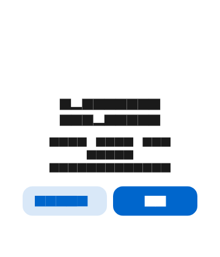
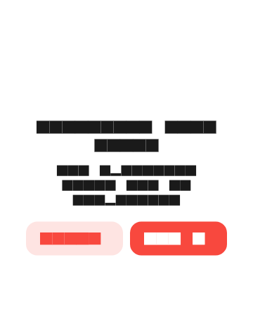
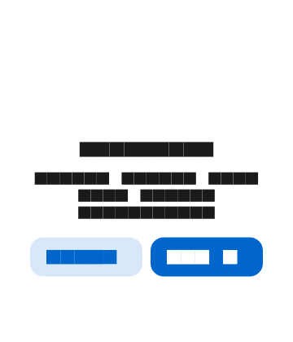
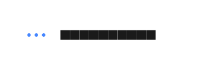
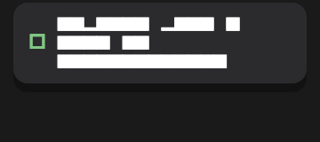
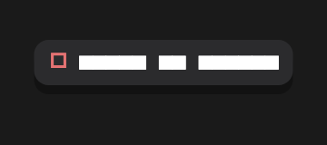
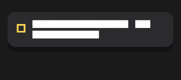

# Flashly

[](https://github.com/7adans/flashly)
[](https://flutter.dev)
[](https://dart.dev)
[](https://flutter.dev)
[](https://github.com/7adans/flashly)

Alerts, toasts, loaders, and haptic/sound feedback for Flutter apps. Flashly provides a consistent, platform-aware UI layer for transient messages and modal dialogs, with optional Lottie animations and native-style styling.

## Screenshots

### Alerts

| Success | Error |
|:---:|:---:|
|  |  |

| Warning | Loader |
|:---:|:---:|
|  |  |

### Toasts

| Success | Error | Info |
|:---:|:---:|:---:|
|  |  |  |

### Loader


## Features

- **Modal alerts** — success, error, info, and warning states with Lottie icons
- **Toasts** — animated overlay messages with swipe-to-dismiss
- **Loader alerts** — blocking dialogs with a loading animation and optional auto-close
- **Inline loaders** — adaptive `CircularProgressIndicator` or Lottie spinner
- **Haptic feedback** — built-in vibration on button presses and optional alert/toast triggers
- **Sound feedback** — optional audio cues via `audioplayers`
- **Platform styling** — frosted-glass alerts on iOS, Material styling on Android

## Requirements

- Dart SDK `>=3.12.0 <4.0.0`
- Flutter `>=3.44.0`

## Installation

Add `flashly` to your `pubspec.yaml`:

```yaml
dependencies:
  flashly:
    path: ../packages/flashly   # adjust path as needed
```

Then run:

```bash
flutter pub get
```

## Setup

Flashly uses global keys to show overlays and dialogs without requiring a `BuildContext` in every call. Wire them into your root `MaterialApp`:

```dart
import 'package:flashly/flashly.dart';
import 'package:flutter/material.dart';

void main() {
  runApp(const MyApp());
}

class MyApp extends StatelessWidget {
  const MyApp({super.key});

  @override
  Widget build(BuildContext context) {
    return MaterialApp(
      navigatorKey: Flashly.navigatorKey,
      scaffoldMessengerKey: Flashly.scaffoldMessengerKey,
      home: const HomePage(),
    );
  }
}
```

When `navigatorKey` is set, `showToast` and `showAlert` (without an explicit `context`) resolve the overlay from the root navigator. You can still pass a `BuildContext` to `showAlert` when you need a local navigator scope.

## Usage

### Alerts

Display a modal dialog with optional title, description, and action buttons:

```dart
showAlert(
  'Operation completed',
  description: 'Your data was saved successfully.',
  positiveTitle: 'OK',
  state: AlertState.success,
  context: context,
);
```

Two-button alert with a destructive action:

```dart
showAlert(
  'Something went wrong',
  description: 'The operation could not be completed.',
  negativeTitle: 'Cancel',
  positiveTitle: 'Try again',
  state: AlertState.error,
  isDestructive: true,
  onPositive: () async {
    // retry logic
  },
  context: context,
);
```

Available `AlertState` values: `success`, `error`, `info`, `warning`.

#### Alert options

| Parameter | Description |
|-----------|-------------|
| `title` | Main heading text |
| `description` | Body text below the title |
| `richTitle` / `richDescription` | Secondary tappable text appended to title or description |
| `negativeTitle` | Left/cancel button label (defaults to `"Cancelar"`) |
| `positiveTitle` | Right/confirm button label; omit for a single-button dialog |
| `state` | Shows a Lottie animation matching the alert type |
| `isDestructive` | Styles the positive button as destructive (red) |
| `onNegative` / `onPositive` | Callbacks when buttons are pressed |
| `enableHaptics` / `enableSound` | Trigger feedback when the alert opens |
| `radius` / `actionButtonRadius` | Corner radius for the dialog and buttons |

### Toasts

Show a short-lived message at the bottom of the screen:

```dart
showToast('Copied to clipboard');

showToast(
  'Failed to send',
  state: ToastState.error,
);

showToast(
  'Sync in progress',
  state: ToastState.info,
  duration: const Duration(seconds: 5),
);
```

Available `ToastState` values: `success`, `error`, `info`.

Toasts slide in from the bottom, auto-dismiss after 3 seconds (configurable), and can be swiped down to dismiss early.

#### Toast options

| Parameter | Description |
|-----------|-------------|
| `message` | Primary toast text |
| `richMessage` | Secondary tappable text appended to the message |
| `state` | Controls the default icon and color |
| `icon` / `iconColor` | Override the default state icon |
| `duration` | How long the toast stays visible (default: 3 s) |
| `enableHaptics` / `enableSound` | Trigger feedback when the toast appears |

### Loader alerts

Show a blocking loading dialog:

```dart
showLoaderAlert(
  placeholder: 'Loading',
  closeLoaderAfterSecs: 45,
  context: context,
);
```

After `closeLoaderAfterSecs` (default: 45), a **Close** button fades in so the user can dismiss the dialog manually. Close it programmatically with:

```dart
closeLoaderAlert();
```

For a timed loader that auto-closes:

```dart
showTimingLoaderAlert('Please wait', 3); // closes after 3 seconds
```

### Inline loaders

Embed a spinner in your own widgets:

```dart
loader(color: Theme.of(context).colorScheme.primary)

loader(
  size: 32,
  asNative: false, // use Lottie animation instead of CircularProgressIndicator
)
```

### Haptic and sound feedback

Trigger feedback independently:

```dart
haptics(impact: HapticImpact.medium);
await playSound();           // success sound
await playSound(true);       // error sound
```

Wrap any `VoidCallback` with automatic haptics:

```dart
onPressed: myCallback.hapticCallback,
```

### Reusable widgets

Flashly also exports building blocks you can use directly:

- `AlertActionButton` — styled dialog action button with press effect
- `PressEffect` — scale/opacity animation on tap
- `Txt` / `RichTxt` — text widgets used inside alerts and toasts

## Sound assets

Sound feedback expects `success.mp3` and `error.mp3` in your app's asset bundle. Add them to your app's `pubspec.yaml`:

```yaml
flutter:
  assets:
    - assets/sounds/success.mp3
    - assets/sounds/error.mp3
```

Then update the paths in `playSound` or call `playAlert` / `playAudio` directly with your asset paths.

## Example

An interactive demo is included in the `example/` directory:

```bash
cd example
flutter run
```

The example covers all alert states, toast variants, loader alerts, and standalone widgets.

## Architecture

```
lib/
├── flashly.dart              # Public API exports
└── src/
    ├── core/
    │   └── flashly.dart      # Global navigator/messenger keys
    ├── alerts/
    │   ├── show_alert.dart   # showAlert() dialog builder
    │   └── alert_state.dart  # AlertState enum
    ├── toasts/
    │   ├── show_toast.dart   # showToast() overlay insertion
    │   ├── animated_toast.dart
    │   └── toast_state.dart  # ToastState enum
    ├── loaders/
    │   ├── loader_alert.dart # showLoaderAlert, closeLoaderAlert
    │   └── flashly_loader.dart
    ├── feedback/
    │   ├── haptic_feedback.dart
    │   └── sound_feedback.dart
    ├── audio/
    │   └── audio_service.dart
    ├── widgets/
    │   ├── alert_container.dart   # Frosted-glass dialog shell
    │   ├── alert_action_button.dart
    │   ├── lottie_animation.dart
    │   ├── press_effect.dart
    │   ├── txt.dart
    │   └── rich_txt.dart
    ├── constants/
    │   ├── animation_assets.dart
    │   └── colors.dart
    └── extensions/
        └── haptic_callback.dart
```

### How it works

**Alerts** are built on Flutter's `showDialog`. The `AlertContainer` widget applies platform-specific styling — backdrop blur and gradient borders on iOS, solid card color on Android. State-specific Lottie animations are loaded from the package's bundled assets via `FlashlyAnimations`.

**Toasts** are inserted directly into the navigator overlay as an `OverlayEntry`. `AnimatedToast` handles slide/fade entrance, auto-dismiss timer, and vertical drag-to-dismiss gestures.

**Loader alerts** reuse the alert dialog with `asLoader: true`, showing a Lottie loading animation beside the placeholder text. A `StatefulBuilder` reveals the close button after the configured timeout.

**Loaders** default to `CircularProgressIndicator.adaptive` with optional color tinting. Set `asNative: false` to use the Lottie loading animation instead.

### Dependencies

| Package | Purpose |
|---------|---------|
| `lottie` | State icons and loading animations |
| `audioplayers` | Optional sound feedback |

## License

See the repository for license details.
